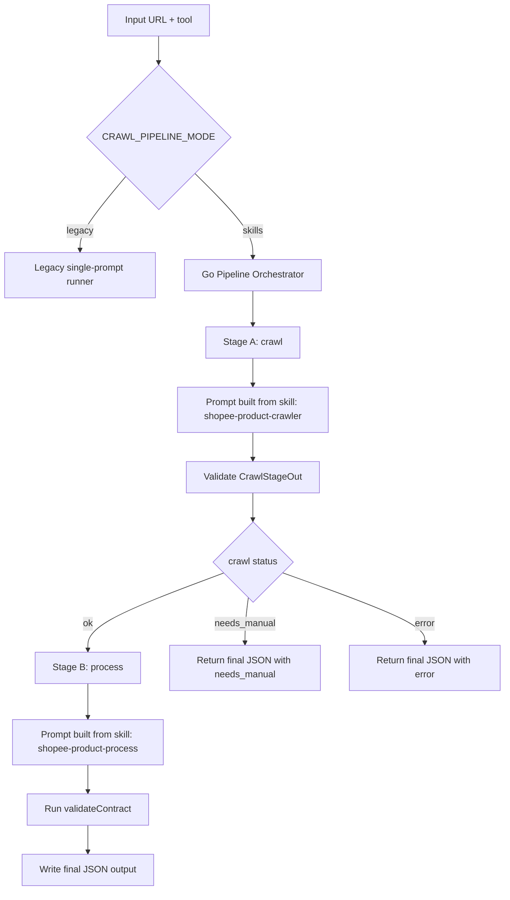
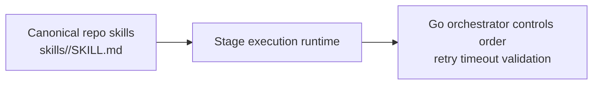

# PRD: Skills-Based Crawl Pipeline for Codex/Gemini

## 1) Summary

This document proposes replacing large monolithic prompt templates with a staged, skills-based pipeline for product crawling.

Initial skill split:
- `shopee-product-crawler`: browser extraction skill (page -> raw crawl payload)
- `shopee-product-process`: transformation skill (raw crawl payload -> final contract JSON)

Pipeline orchestrator responsibility:
- Execute skills in deterministic order
- Validate stage outputs
- Handle retries/repair/fallbacks
- Produce one final contract-compliant JSON object

This plan uses a hybrid model:
- native CLI skills for packaging/discovery
- deterministic orchestration in Go for execution order and validation

This keeps behavior stable across `codex` and `gemini` CLIs while still following each CLI's skill conventions.

## 2) Problem Statement

Current prompt files (`config/prompt.shopee.product.txt`, `config/prompt.taobao.product.txt`) are large and combine multiple concerns:
- browser control and crash recovery
- extraction heuristics
- normalization/transformation rules
- output contract policy

This causes:
- low maintainability (hard to update one behavior without touching all)
- weak reusability (same logic repeated across source-specific prompts)
- inconsistent behavior across tools when long prompts are interpreted differently
- difficult testing of intermediate behaviors

## 3) Goals

- Decompose crawling into explicit stages with clear stage contracts.
- Keep final output contract unchanged for downstream compatibility.
- Support both `codex` and `gemini` runners with one orchestrated flow.
- Reduce prompt size per step and improve reliability/debuggability.
- Version stage instructions as reusable "skills" in repository.

## 4) Non-Goals

- Replacing Chrome DevTools MCP usage model.
- Changing worker queue or database schema.
- Introducing a new external orchestration service.
- Full multi-source expansion in one pass (Shopee first, Taobao parity second).

## 5) Current State (As-Is)

Prompt loading path today:
- Prompt file selected by URL source in `internal/runner/runner.go`
- File loaded and `{{URL}}` substituted in `loadPrompt(...)`
- Prompt passed as one string into runner CLI invocation:
  - Gemini: `internal/runner/gemini.go`
  - Codex: `internal/runner/codex.go`

Output handling today:
- Runners return model output
- `runner.parseResult(...)` extracts first JSON object
- `validateContract(...)` enforces final output contract

## 5.1) Native Skill Conventions (validated direction)

Both tools support skills, but conventions differ.

Codex:
- Skill package format is `SKILL.md` in a skill folder (plus optional `scripts/`, `references/`, `assets/`).
- Workspace convention should follow Codex docs (`.agents/skills/...`).
- In this environment, user-level skills are also present under `~/.codex/skills/...`.

Gemini CLI:
- Supports `gemini skills install|enable|disable|list`.
- Supports scoped install (`--scope workspace|user`).
- Workspace skill installation is managed by Gemini CLI and resolves under workspace skill storage.

Implication:
- We should not assume one identical folder convention for both CLIs.
- We should keep one canonical in-repo skill source (`skills/`) and load it directly from Go orchestrator code.

## 6) Proposed Architecture (To-Be)

### 6.1 High-level flow

1. `Stage A: Crawl`
- Input: `{ url, source }`
- Skill: `shopee-product-crawler`
- Output: `CrawlStageOut` (raw extracted payload + status)

2. `Stage B: Process`
- Input: `CrawlStageOut`
- Skill: `shopee-product-process`
- Output: `FinalStageOut` (final product JSON contract)

3. `Final validation`
- Existing `validateContract(...)` remains final gate

### 6.2 Why orchestrator in Go (recommended)

- Deterministic execution order regardless of model/tool behavior
- Explicit typed checkpoints between stages
- Better observability per stage (latency/failure cause)
- Safer cross-tool compatibility than implicit native skill auto-selection

### 6.3 Skills packaging strategy

Use one canonical skill source in-repo. The Go orchestrator loads these files directly when building stage prompts.

Canonical source (repo-tracked):
- `skills/shopee-product-crawler/SKILL.md`
- `skills/shopee-product-process/SKILL.md`
- optional:
  - `skills/_shared/...`
  - `skills/<name>/scripts/...`
  - `skills/<name>/references/...`

Runtime model:
- Orchestrator still controls stage order.
- Each stage prompt explicitly requests the corresponding skill behavior and stage contract.
- Final output is validated in Go (existing contract gate).

### 6.4 Orchestrator decision: model vs code

Option A: Model-orchestrated pipeline (a meta-skill chooses which skill to run next)
- Pros:
  - less Go orchestration code
  - flexible behavior changes through prompts/skills
- Cons:
  - lower determinism (stage order can drift)
  - harder to enforce strict retries/timeouts and failure routing
  - harder to debug and reproduce production failures
  - higher cross-tool variance between Codex and Gemini

Option B: Code-orchestrated pipeline (Go decides stage order and calls tools per stage)
- Pros:
  - deterministic order (`crawl` then `process`)
  - explicit contract checks between stages
  - clear retry, timeout, and short-circuit rules
  - easier observability and incident debugging
  - better cross-tool consistency
- Cons:
  - more implementation code in Go

Decision:
- Choose Option B (code-orchestrated) as the production path.
- Keep skills for stage behavior packaging, not for execution control flow.
- A meta-skill orchestrator may be explored later as an experimental mode, but not as default.

### 6.5 Visual Flow

End-to-end runtime flow:



Canonical skills consumed directly by orchestrator:



## 7) Functional Requirements

### FR-1 Stage definition
- System MUST support at least two ordered stages for Shopee:
  - `crawl`
  - `process`

### FR-2 Stage input/output contracts
- Each stage MUST have a typed Go contract and validation.
- Stage output MUST be persisted in debug logs (truncated) and optionally to `out/stages/` in debug mode.

### FR-3 Final compatibility
- Final output MUST still match existing contract consumed by current pipeline and storage.

### FR-4 Error model
- Stage failure MUST map to one of:
  - `needs_manual` (captcha/login/verification)
  - `error` (technical or extraction failure)

### FR-5 Tool parity
- Pipeline MUST work with both `tool=codex` and `tool=gemini`.

### FR-6 Skill source of truth
- System MUST use `skills/<name>/SKILL.md` as the canonical source for stage instructions.
- Stage prompt building MUST load skill content directly from repo files (no required native CLI sync/install step).

## 8) Non-Functional Requirements

- Reliability: one run should fail fast with actionable stage-level error messages.
- Determinism: fixed stage order and explicit transitions.
- Observability: stage-level logs and metrics fields.
- Maintainability: skill files editable independently from orchestration code.

## 9) Data Contracts

### 9.1 Stage A output (`CrawlStageOut`, draft)

```json
{
  "url": "string",
  "status": "ok | needs_manual | error",
  "captured_at": "ISO-8601 UTC timestamp",
  "notes": "string",
  "error": "string",
  "title": "string",
  "price_raw": "string",
  "currency_raw": "string",
  "description_raw": "string",
  "images": ["string"],
  "description_images": ["string"],
  "variation_groups": [
    {
      "name": "string",
      "options": ["string"]
    }
  ]
}
```

Notes:
- `*_raw` fields intentionally preserve unnormalized text.
- Required keys differ by `status` (same policy as final contract style).

### 9.2 Stage B output
- Must produce current final contract shape already validated by `validateContract(...)`.

## 10) Implementation Plan

## Phase 0: Alignment and guardrails

- Confirm final Stage A contract fields.
- Confirm whether Taobao follows same two-stage model or a tailored pair.
- Add doc section in `README.md` describing pipeline mode and debug outputs.
- Confirm canonical skill source directory and direct-loading behavior in orchestrator.

Deliverable:
- agreed contracts + docs update

## Phase 1: Introduce pipeline orchestration (no behavior change yet)

- Add new types:
  - `internal/runner/pipeline.go`
  - `internal/runner/stage_contracts.go`
- Add `PipelineOrchestrator` that can run a sequence of `Stage` definitions.
- Keep legacy single-prompt mode as default.

Deliverable:
- compile-safe orchestrator skeleton behind feature flag

## Phase 2: Canonical skill files + prompt composition

- Add canonical skill files under `skills/<name>/SKILL.md`.
- Add prompt composer utility:
  - loads skill text
  - injects structured input JSON
  - appends strict output guard
- Add URL/source substitution where required.
Deliverable:
- stage prompt generation unit tests

## Phase 3: Stage A (crawl) execution path

- Implement `runCrawlStage(...)` using existing tool runners.
- Parse and validate `CrawlStageOut`.
- On `needs_manual`/`error`, short-circuit pipeline with mapped final output.

Deliverable:
- end-to-end run that completes Stage A and persists intermediate result

## Phase 4: Stage B (process) execution path

- Implement `runProcessStage(...)` consuming Stage A JSON.
- Validate final output with existing `validateContract(...)`.

Deliverable:
- successful two-stage final output for Shopee

## Phase 5: Rollout and migration

- Add config flag:
  - `CRAWL_PIPELINE_MODE=legacy|skills`
- Default to `legacy` first.
- Run A/B shadow tests on sample URLs.
- Promote `skills` to default after stability threshold.

Deliverable:
- controlled rollout with rollback switch

## 11) Repo-Level Change Plan (proposed files)

New:
- `internal/runner/pipeline.go`
- `internal/runner/stage_contracts.go`
- `internal/runner/stage_executor.go`
- `internal/runner/stage_prompt_builder.go`
- `skills/shopee-product-crawler/SKILL.md`
- `skills/shopee-product-process/SKILL.md`
- `docs/skills-pipeline-prd.md` (this file)

Updated:
- `internal/runner/runner.go` (route to legacy vs pipeline mode)
- `config/config.go` (add pipeline mode config if approved)
- `README.md` (run instructions + mode flags)

## 12) Testing Strategy

### Unit tests
- Stage prompt composition
- Stage A contract validation
- Stage transition mapping (`ok|needs_manual|error`)
- Final contract validation remains passing

### Integration tests
- Shopee URL happy path (`status=ok`)
- blocked wall path (`status=needs_manual`)
- malformed stage output repair/failure path
- codex + gemini parity runs

### Regression tests
- `GET /health` unchanged
- legacy mode behavior unchanged when pipeline disabled

## 13) Risks and Mitigations

- Risk: Model output drift between tools
  - Mitigation: strict stage schema validation + one repair pass + final gate

- Risk: More model calls increase latency/cost
  - Mitigation: keep Stage B short and deterministic; add timeout budget per stage

- Risk: Ambiguous ownership between skill text and Go logic
  - Mitigation: contracts in Go are source of truth; skill files only describe behavior

- Risk: Stage instruction drift across tools
  - Mitigation: one canonical `skills/` source loaded directly by orchestrator + shared stage contracts in Go

## 14) Rollout Metrics

Track before/after:
- parse/contract failure rate
- `needs_manual` rate
- average crawl duration per URL
- token usage (if available)
- success rate split by tool (`codex` vs `gemini`)

Promotion criteria (example):
- 3 consecutive days with no regression in success rate
- contract failure rate lower than legacy mode

## 15) Open Questions

1. Should Stage B be model-based initially, or deterministic Go normalization first?
2. Should Taobao reuse the same `process` stage contract or have a dedicated variant?
3. Do we persist stage intermediates in production or debug-only?
4. Should repair prompts be stage-specific or shared utility?
5. Do we add an experimental `CRAWL_PIPELINE_MODE=model_orchestrated` later, or keep only code-orchestrated modes?

## 16) Recommendation

Proceed with a hybrid approach:
- keep deterministic orchestration in Go
- keep skill content as canonical `skills/<name>/SKILL.md`
- load canonical skills directly from repo files in stage prompt builder
- avoid hard dependency on implicit skill auto-selection for stage order

Recommendation call:
- Yes, use code-orchestrated pipeline as default and production path.

This gives the maintainability benefit you want without sacrificing reliability across tools.

## 17) Implementation Contract (for next agent)

This section is normative for implementation. If any item conflicts with earlier draft language, this section wins.

### 17.1 Required Go types and interfaces

Add the following contracts in `internal/runner/stage_contracts.go` and `internal/runner/pipeline.go`.

```go
type PipelineMode string

const (
    PipelineModeLegacy PipelineMode = "legacy"
    PipelineModeSkills PipelineMode = "skills"
)

type StageName string

const (
    StageCrawl   StageName = "crawl"
    StageProcess StageName = "process"
)

type StageInput map[string]any
type StageOutput map[string]any

type StageSpec struct {
    Name      StageName
    SkillName string
    Timeout   time.Duration
    MaxRetry  int
}

type StageExecutor interface {
    Execute(ctx context.Context, spec StageSpec, in StageInput, opts Options) (StageOutput, error)
}

type PipelineOrchestrator interface {
    Run(ctx context.Context, opts Options) (Result, error)
}
```

### 17.2 Stage contracts (required keys)

`crawl` stage output must include:
- `url` (string)
- `status` (`ok|needs_manual|error`)
- `captured_at` (string, RFC3339/RFC3339Nano)
- `title` (string, required if status=ok)
- `price_raw` (string, required if status=ok)
- `images` (array, required if status=ok; empty allowed)
- `notes` (string, required if status=needs_manual)
- `error` (string, required if status=error)

`process` stage output must satisfy existing final contract validated by `validateContract(...)`.

Validation behavior:
- Invalid stage JSON or missing required keys => stage failure (`error` path).
- Do not continue to next stage after failure.

### 17.3 Pipeline behavior

Execution order is fixed:
1. `crawl`
2. `process` (only when crawl status is `ok`)

Short-circuit rules:
- If crawl returns `needs_manual`, return final result with same status and `notes`; skip process.
- If crawl returns `error`, return final result with same status and `error`; skip process.

Output defaults:
- Always ensure final `url`, `captured_at`, and `images` (existing `ensureImagesArray` behavior).

### 17.4 Retry and timeout policy

Default stage policy:
- `crawl`: `timeout=90s`, `max_retry=1` (total attempts: 2)
- `process`: `timeout=45s`, `max_retry=0` (total attempts: 1)

Retry trigger:
- Retry only on execution/parsing/validation failure.
- Do not retry when stage returned valid `needs_manual`.

Backoff:
- Fixed 1 second between attempts.

### 17.5 Prompt envelope contract

All stage prompts must be built by `internal/runner/stage_prompt_builder.go` with this format:

1. Skill body (`skills/<name>/SKILL.md`) verbatim.
2. A machine-readable input block:
   - prefix: `STAGE_INPUT_JSON:`
   - content: compact JSON object
3. A strict output rule block:
   - `Return EXACTLY ONE JSON object.`
   - `No markdown fences.`
   - `No extra prose.`
   - `Do not omit required keys for current status.`

No ad-hoc stage prompt construction elsewhere.

### 17.6 Skill loading contract

Stage prompt builder MUST load skill text directly from:
- `skills/shopee-product-crawler/SKILL.md`
- `skills/shopee-product-process/SKILL.md`

Behavior:
- Missing skill file is a hard error for that stage.
- No native CLI skill installation/synchronization script is required for pipeline execution.

### 17.7 Config and mode switching

Add config flag:
- `CRAWL_PIPELINE_MODE` with values `legacy|skills`
- Default: `legacy`

Routing:
- `legacy`: existing single-prompt behavior unchanged.
- `skills`: execute orchestrator path.

### 17.8 Logging contract

For each stage attempt, log:
- `pipeline_stage_started` with `stage`, `tool`, `url`, `attempt`
- `pipeline_stage_finished` with `stage`, `duration_ms`, `status`
- `pipeline_stage_failed` with `stage`, `duration_ms`, `error`

Do not log full model output at info level.

### 17.9 Test and acceptance checklist (must pass)

Unit tests:
- stage prompt builder output format
- crawl stage validation matrix (`ok|needs_manual|error`)
- pipeline short-circuit logic
- retry policy behavior

Integration tests (or golden tests if live tools unavailable):
- skills mode happy path (crawl ok -> process ok)
- crawl `needs_manual` short-circuit
- crawl parse failure -> retry once -> fail

Regression:
- `legacy` mode behavior unchanged
- existing contract validation still enforced

Manual acceptance commands:
- `go test ./internal/runner/...`
- one local `devtool once` run with `CRAWL_PIPELINE_MODE=legacy`
- one local `devtool once` run with `CRAWL_PIPELINE_MODE=skills`

### 17.10 Explicitly out of scope for this implementation

- Changing DB schema
- Changing AMQP topology
- Adding new external services
- Full Taobao pipeline parity (can be follow-up PR)
